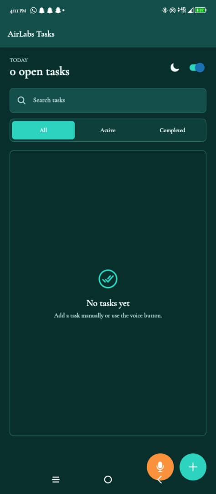
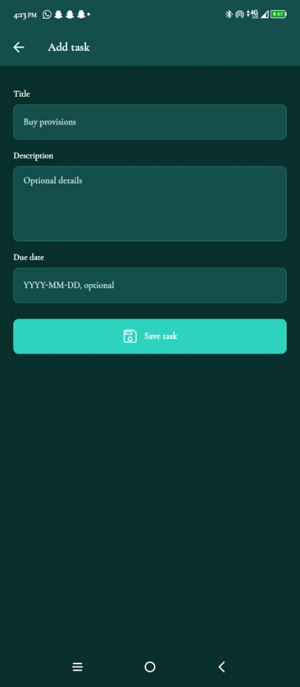
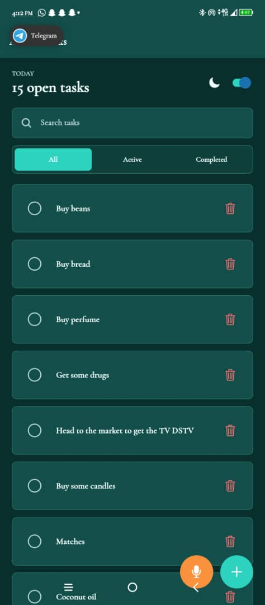
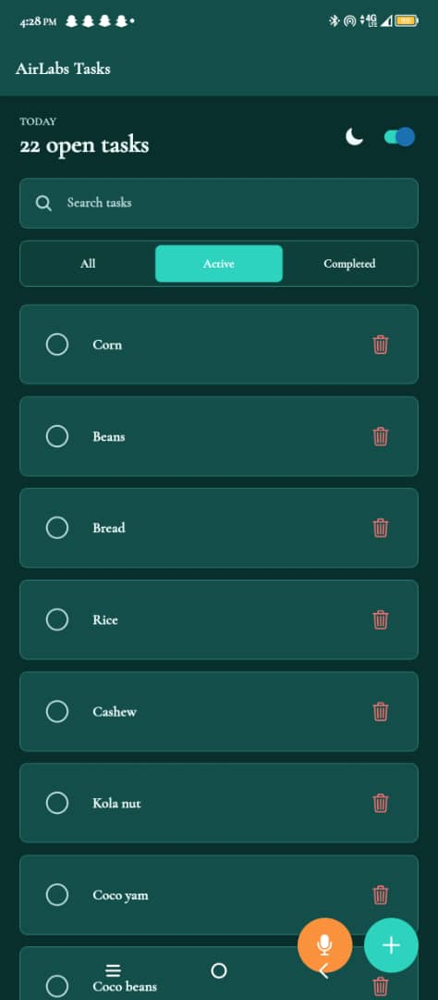
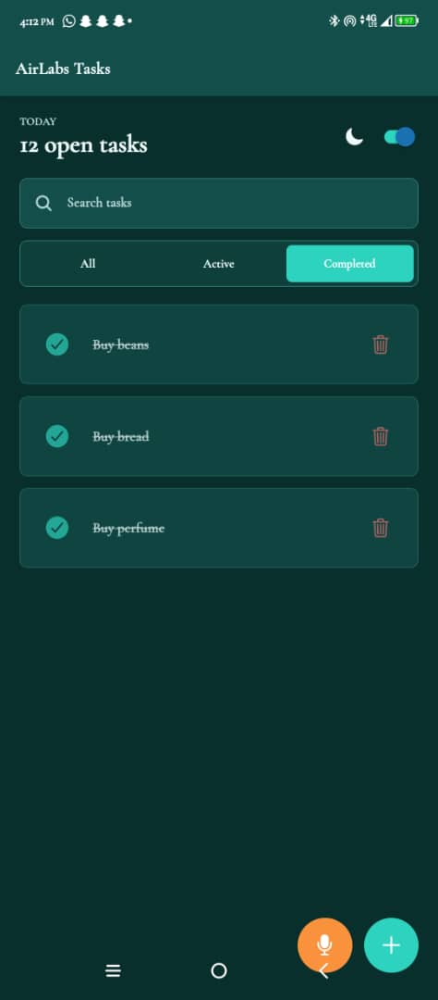
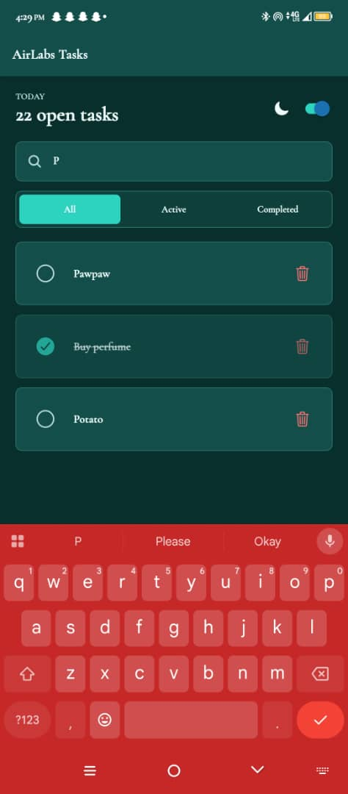
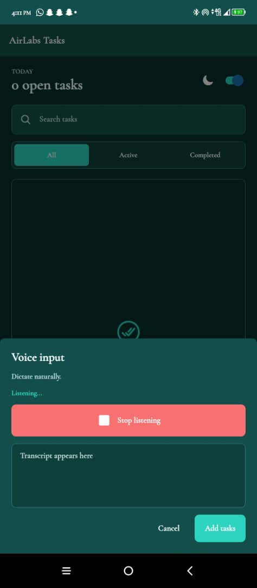
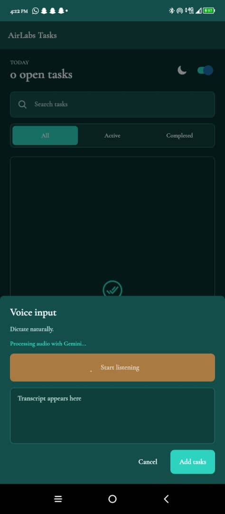
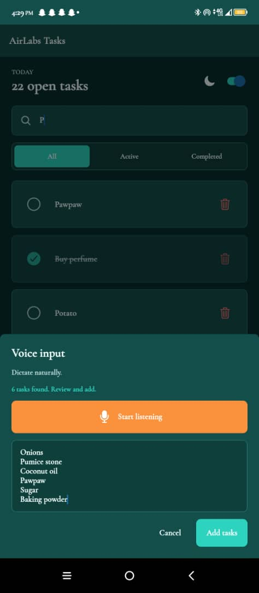

# AirLabsTodo

React Native Expo Go to-do list app for the AirLabs developer exercise.

## Features

- Add tasks with title, optional description, and optional due date
- Mark tasks complete or incomplete
- Delete tasks
- View all tasks with completed and incomplete visual distinction
- Persist tasks locally with AsyncStorage
- React Navigation with Task List and Add Task screens
- Voice input FAB with microphone recording, Gemini audio transcription, and intelligent task extraction
- Search, due-date sorting, light/dark theme toggle
- All, active, and completed filters
- Layout transitions when tasks are added, toggled, deleted, or filtered
- Unit tests for task parsing, Gemini response parsing, MIME detection, filtering, and due-date sorting

## Run

```bash
npm install
npm start
```

Scan the Expo QR code with Expo Go, or run on an emulator from the Expo developer tools.

## Test

```bash
npm test
```

## Voice Input

To enable automatic transcription, add your Gemini key to `.env`:

```bash
EXPO_PUBLIC_GEMINI_API_KEY=your_gemini_api_key_here
```

Then restart Expo with a clean cache:

```bash
npm start -- --clear
```

The voice modal records audio, sends it to Gemini, extracts task titles, and lets you review them before adding. Without a working API key, the modal still supports manual transcript entry so the task-splitting flow can be tested.

## Demo Video

View the app walkthrough video on Google Drive:

[Watch the demo video](https://drive.google.com/file/d/142W5C6qqytWRp876jr6aH9s2gELOKjgW/view?usp=sharing)

## Screenshots

The screenshots below are captured from the running Expo app and cover the required screens and key states.

### Empty Task List

Shows the task list empty state before any task has been added.



### Add Task Screen

Shows the manual task creation screen with title, description, and due date fields.



### All Tasks

Shows the main task list with multiple tasks displayed together.



### Active Tasks

Shows the active filter displaying incomplete tasks.



### Completed Tasks

Shows completed tasks with a distinct completed visual state.



### Filtered Search

Shows task search/filter behavior after entering text.



### Voice Input Listening

Shows the FAB voice input modal while the app is listening for dictated tasks.



### Voice Input Processing

Shows the app processing recorded audio with Gemini.



### Generated Voice Tasks

Shows tasks generated from dictated voice input before they are added to the list.


